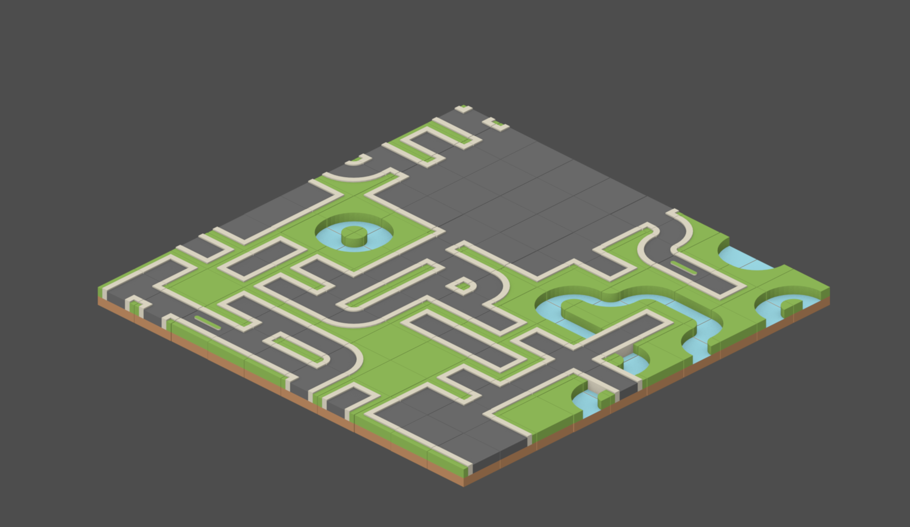
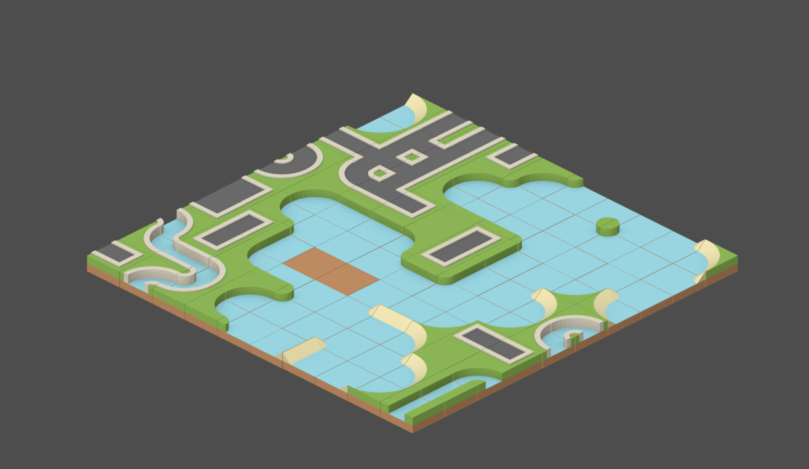
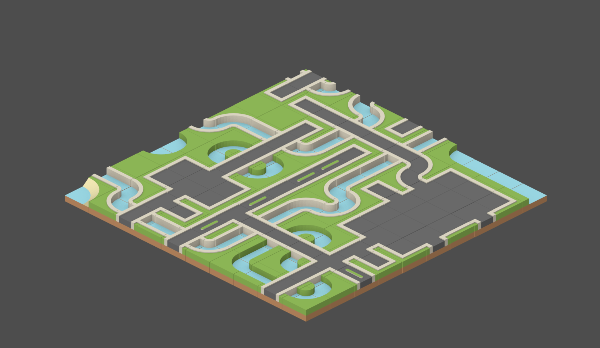
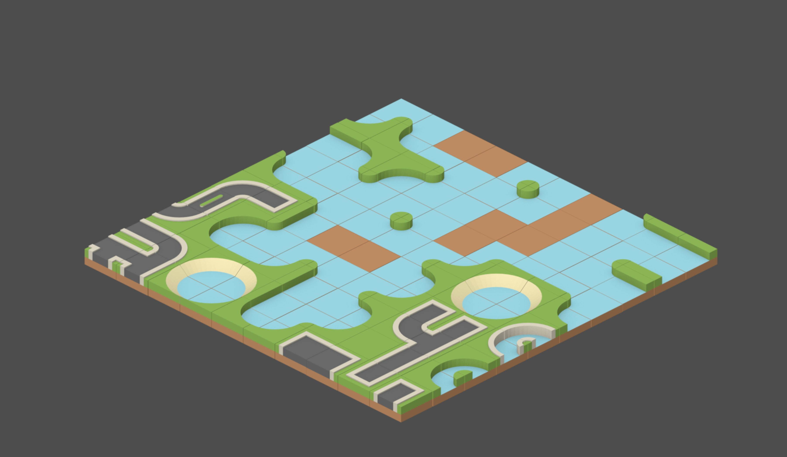

# Godot Wave Function Collapse

A WFC plugin written in Rust and exposed in Godot using GDExtensions.

## Implemented classes

A WFC Map class is implemented on top of the TileMapLayer class. 

## How to run

To run the example, navigate to the rust subfolder and run 

```
cargo build
```

Then open Godot and the project under the godot subfolder and hit run!

## Interactions

- Spacebar would create a random map using WFC on the isometric maps tileset.
- Scrolling will zoom in/out.





